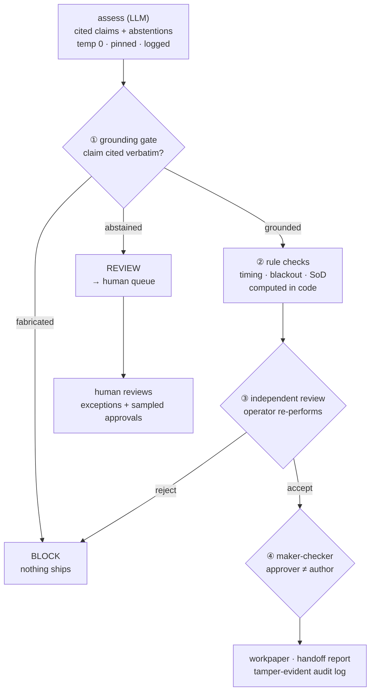

# assay

> **🛡 Govern (capstone)** · part 3 of a 3-part series on measuring & governing AI in regulated domains —
> [🔎 Validate](https://github.com/stephendchu/agentic-test-eval) · [📊 Measure](https://github.com/stephendchu/filing-event-eval) · **Govern (here)**

> *You don't make the model trustworthy — you make the **system** trustworthy despite the model.*

---

## The problem

LLMs are good at reading messy documents and drawing conclusions. The problem in regulated industries — finance, healthcare, legal — is that a wrong answer that ships quietly is worse than no answer at all. Compliance decisions have to be **provable**, **auditable**, and **defensible to a regulator**. A confident hallucination doesn't cut it.

The standard approach is to prompt-engineer your way to accuracy and hope. `assay` takes a different position: treat the LLM as one unreliable component in a system that's designed to catch its failures, not trust them.

## What it does

`assay` is a governance layer for AI decisions in high-consequence domains. The LLM does the reading. A gauntlet of deterministic checks, independent review, and human escalation handles everything the LLM can get wrong.

Two real compliance domains are implemented as proof it generalizes:

**Personal account dealing (PAD) surveillance** — in financial services, employees must get pre-approval before trading securities their firm is involved with. `assay` reconciles an employee's trade against approval emails, a blackout list, covered accounts, and timing rules. It flags violations, routes ambiguous cases to humans, and produces a workpaper a compliance officer can defend.

**SOX change-management testing** — Sarbanes-Oxley requires that production code changes are authorized, tested, and approved by someone other than the person who made the change. `assay` evaluates a change ticket against those controls and flags failures with evidence.

Same engine under both — that's the point.

## Three layers of defense

No single check is trusted. Every AI decision passes through:

1. **Grounding gate** — every claim the model makes must cite verbatim evidence from the source documents. A fabricated citation is **blocked** before it can proceed. Catches hallucination.
2. **Deterministic rules** — timing violations, blackout list membership, and segregation-of-duties checks are computed in code, not left to the model. Catches wrong conclusions drawn from real evidence.
3. **Abstention → human** — when evidence is genuinely ambiguous, the model flags it rather than guessing ("an informal 'go ahead' isn't a formal approval") and routes to a human review queue. Never guesses on the unknowable.

Around the run: temperature 0 with a pinned model version, every prompt and raw output logged, independent review by a separate operator, maker-checker approval, and a tamper-evident audit log.

## The gated pipeline



## Every guarantee is backed by a test and an artifact

| Guarantee | Proof |
|---|---|
| **Reproducible** — temp 0, pinned model, prompt + raw output logged | `test_llm_mapping_is_logged_for_reproducibility` · [`sample_run/clean/artifacts/llm_mapping.json`](examples/sample_run/clean/artifacts/llm_mapping.json) |
| **Anti-hallucination** — fabricated citation is blocked | `test_llm_fabricated_citation_is_blocked` · [`sample_run/blocked/audit.jsonl`](examples/sample_run/blocked/audit.jsonl) |
| **Abstention works** — ambiguous evidence routes to human, not a guess | `test_abstention_routes_to_review`, `test_ambiguous_punts_to_human` |
| **Rules in code** — timing / blackout decided deterministically, not by the model | `test_late_preapproval_is_a_violation`, `test_blackout_trade_is_a_violation` |
| **Independent review** — a separate operator re-performs the check | `test_independent_reviewer_can_reject` |
| **Tamper-evident log** — edit any record and `verify()` fails | `test_audit_tamper_is_detected` |
| **Resumable** — a paused run resumes without recomputation | `test_block_halts_and_resume_is_idempotent` |
| **Measured** — gold set with control-F1 + bootstrap CIs, honest baseline finding | [docs/EVAL.md](docs/EVAL.md) · `test_deterministic_baseline_runs_and_scores` |

## Quickstart

```bash
python3 -m venv .venv && source .venv/bin/activate
pip install -e ".[dev]"
pytest -q                                  # full test suite runs offline, no API key
python examples/change_approval_demo.py    # SOX: gate blocks a fabricated approval
python examples/personal_trade_demo.py     # PAD: clears / violations / routes to human
python examples/review_queue_demo.py       # stratified human-review queue
```

Model-backed runs use any backend — Claude or a free OpenAI-compatible one (see `.env.example`). The whole test suite runs offline.

## Scope and limits

- Verifies a claim is **traceable to the provided evidence** — not that the evidence itself is authentic. A forged approval that's faithfully cited still passes the gate; evidence authenticity is a separate control.
- Assurance is by **measured reliability + sampling**, not exhaustive review. The gold set is small and synthetic.
- This is a **reference implementation**, not a production platform — no concurrency, multi-tenancy, or durability hardening.

## Layout

```
src/assay/
  grounding.py  gate.py  graders.py  faithfulness.py  llm.py  eval.py  review.py
  plane/  audit.py  core.py
  apps/personal_trade/     # PAD surveillance
  apps/change_approval/    # SOX change-management
```

Full design docs including data flow, RACI, control register, and runbook: **[docs/](docs/)**

*Public / synthetic data only. No proprietary content.*
