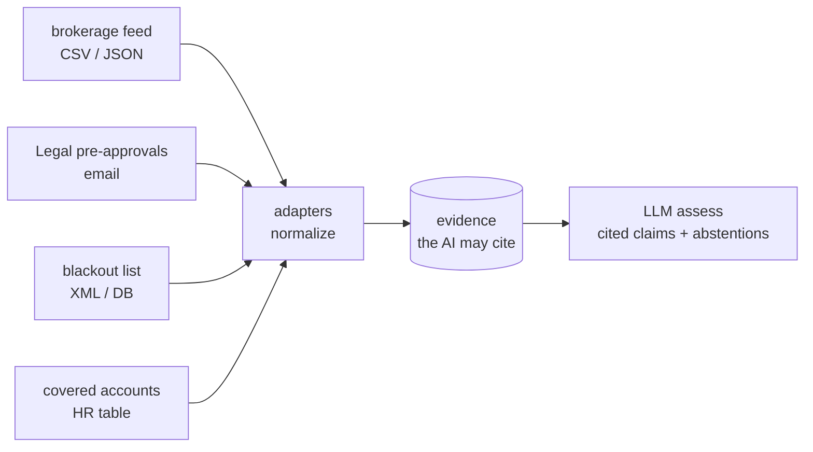
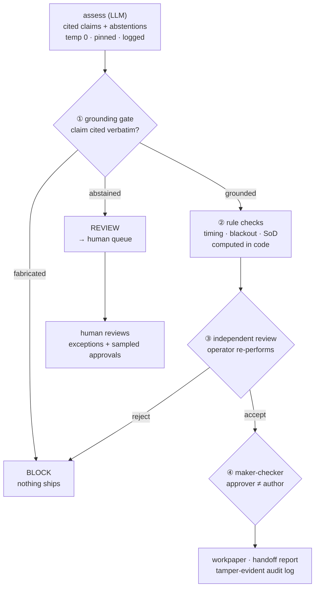

# assay

> **🛡 Govern (capstone)** · part 3 of a 3-part series on measuring & governing AI in regulated domains —
> [🔎 Validate](https://github.com/stephendchu/agentic-test-eval) · [📊 Measure](https://github.com/stephendchu/filing-event-eval) · **Govern (here)**

**An audit-first evaluation & governance control plane for AI in high-consequence, regulated domains.**

The hard part isn't getting an LLM to read messy compliance evidence — it's being able to
**prove** its judgments are right, **refuse** the ones that aren't, and **defend** the whole
thing to an auditor. `assay` is that layer: it lets an LLM do the reading, then grounds,
gates, reviews, and audits every decision so a wrong answer can't quietly ship.

> The stance: *you don't make the model trustworthy — you make the **system** trustworthy despite the model.*

---

## What's here
A reusable **engine** + **two regulated domains** running on it (the proof it generalizes):

- **🏦 `apps/personal_trade` — flagship.** Personal-account-dealing (PAD) surveillance:
  reconcile an employee trade against Legal pre-approvals, emails, a blackout list, and
  covered accounts; flag pre-clearance / timing / blackout violations.
- **📋 `apps/change_approval` — the clean proof.** SOX **ITGC change-management** control
  testing: did a production change meet the controls (authorized, tested, segregation of duties)?

Same engine under both — that's the point.

## Three layers of defense
An LLM is fallible, so no single check is trusted. Every decision passes through:

1. **Grounding gate** — every claim must cite **verbatim** evidence; a *fabricated* citation
   is **BLOCK**ed. *(Catches hallucination.)*
2. **Deterministic rules** — the logic (timing, list membership, SoD) is **computed in code**,
   never left to the model. *(Catches wrong conclusions drawn from real evidence.)*
3. **Abstention → human** — when evidence is genuinely ambiguous, the model **abstains**
   ("an informal 'go ahead' isn't a formal approval") and the case is routed to a human
   review queue. *(Punts the unknowable; never guesses.)*

Around the run: **reproducibility** (temperature 0, pinned model, prompt + raw output logged),
an **independent review** (a separate operator re-performs the check — the preparer never
validates its own work), a **maker-checker** approval (≠ author), a **tamper-evident audit
log**, and a **3rd-party handoff report**.

## How it works — data flow & control gates

**Data flow** — messy multi-format sources are normalized, then the LLM may cite only that evidence:



**The gated pipeline** — every decision runs the gauntlet; nothing ships unproven:



**The gates & checks:**

| # | Gate / check | Type | Catches | Outcome |
|---|---|---|---|---|
| ① | **Grounding gate** | deterministic (model-free) | fabricated citations (hallucination) | **BLOCK** |
| — | **Abstention** | model self-flag | genuinely ambiguous evidence | **REVIEW** → human |
| ② | **Rule checks** (timing, blackout, SoD) | deterministic | wrong conclusions drawn from real evidence | violation recorded |
| ③ | **Independent review** | separate operator (re-performs) | the preparer grading its own work | reject → **BLOCK** |
| ④ | **Maker-checker** | human (≠ author) | unauthorized sign-off | approve / hold |
| ✓ | **Reproducibility** | logged: temp 0, pinned model, prompt + raw output | a control an auditor can't re-perform | audit artifact |
| ✓ | **Tamper-evident audit log** | hash chain | silent edits to the trail | `verify()` fails |

## Quickstart
```bash
python3 -m venv .venv && source .venv/bin/activate
pip install -e ".[dev]"
pytest -q
python examples/change_approval_demo.py    # SOX change-mgmt: the gate blocks a fabricated approval
python examples/personal_trade_demo.py     # PAD: clears / violations / punts-to-human
python examples/review_queue_demo.py       # stratified human-review queue
```
Model-backed runs use any backend — Claude or a **free** OpenAI-compatible one (see
`.env.example`). The whole test suite runs **offline, no key.**

## Proofs (show, don't tell)
Each guarantee is backed by a **test** (`pytest -q`) *and* an **artifact you can open** in
[`examples/sample_run/`](examples/sample_run/):

| Guarantee | Proof |
|---|---|
| **Reproducible AI control** — temp 0, pinned model, prompt + raw output + model id logged | test `test_llm_mapping_is_logged_for_reproducibility` · [`sample_run/clean/artifacts/llm_mapping.json`](examples/sample_run/clean/artifacts/llm_mapping.json) |
| **Anti-fabrication** — a fabricated citation is **BLOCK**ed | test `test_llm_fabricated_citation_is_blocked` · [`sample_run/blocked/audit.jsonl`](examples/sample_run/blocked/audit.jsonl) |
| **Abstention → human** — ambiguous evidence routes to REVIEW, not a guess | tests `test_abstention_routes_to_review`, `test_ambiguous_punts_to_human` |
| **Deterministic rule logic** — timing / blackout decided in code, not by the model | tests `test_late_preapproval_is_a_violation`, `test_blackout_trade_is_a_violation` |
| **Independent review** — a separate operator re-performs the check (not the agent) | test `test_independent_reviewer_can_reject` |
| **Tamper-evident audit log** — edit any record and `verify()` fails | test `test_audit_tamper_is_detected` |
| **Idempotent / resumable** — a paused run resumes, no recomputation | test `test_block_halts_and_resume_is_idempotent` |
| **Measured eval** — gold set, control-F1 + bootstrap CIs, an *honest* baseline finding | [docs/EVAL.md](docs/EVAL.md) · test `test_deterministic_baseline_runs_and_scores` |

*Offline samples use an injected judge (no key) so they're reproducible; a live run logs the real model id.*

## Layout
```
src/assay/
  grounding.py gate.py graders.py faithfulness.py llm.py eval.py review.py   # the engine
  plane/  audit.py core.py                                                   # deterministic, audited run loop
  apps/personal_trade/    # flagship domain — PAD surveillance
  apps/change_approval/   # proof domain — SOX ITGC change-management
```

## Governance docs
Running AI in a regulated environment is a *controlled process*, documented like any
financially-relevant system — see **[docs/](docs/)**: data flow, stakeholders / RACI, the
control register, auditable artifacts, validation (golden dataset), observability
(vendor-neutral), runbook (SLAs + retention), escalation.

## Scope & limits (what it deliberately does *not* do)
- It verifies a claim is **traceable to the evidence** — *not* that the evidence is
  **authentic**. A forged approval that's faithfully cited still passes the gate; evidence
  authenticity and **population completeness** (the change that bypassed the process) are
  *separate* controls, on the roadmap.
- Assurance is by **measured reliability + sampling**, not exhaustive review — the gold set
  is small and synthetic; recall is "vs the labels we wrote," not omniscience.
- It's a **reference implementation**, not a production platform (no concurrency / durability
  / multi-tenant hardening — out of scope by design).

## Roadmap
Full plan & the decisions behind it: **[ROADMAP.md](ROADMAP.md)**. Next: live
model-vs-baseline eval number · Phoenix/OTel trace · source adapters (CSV/JSON/XML/email) ·
external audit-log anchoring · population reconciliation.

*Public / synthetic data only. No proprietary content.*
