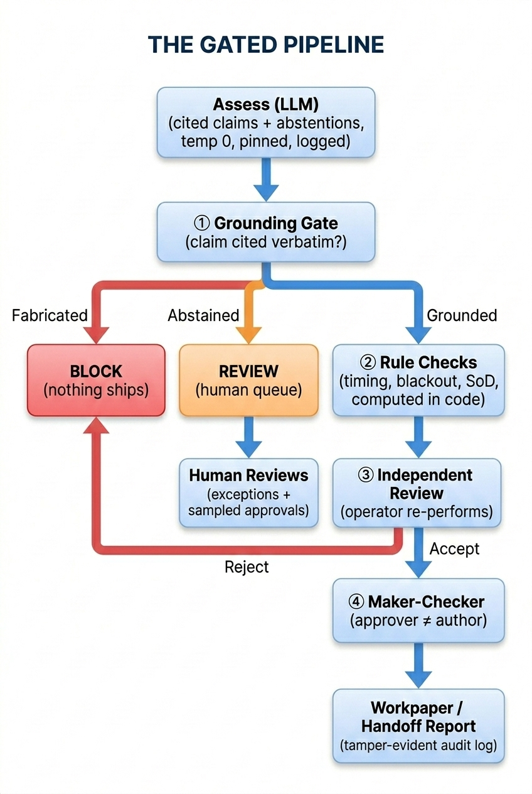

# assay

[](https://github.com/stephendchu/assay/actions/workflows/tests.yml)

> *as·say (n.) — a test of whether something is what it claims to be. Here: every AI decision in a regulated workflow.*

**Trustworthy AI for compliance — by design, not by hope.** An audit-first governance layer that puts an LLM to work on messy filings, trade records, and change tickets — then catches everything the model gets wrong *before it ships*.

> **🛡 Govern — the system** · part 3 of a 3-part series on measuring & governing AI in regulated domains —
> [🔎 Validate](https://stephendchu.github.io/agentic-test-eval/) · [📊 Measure](https://stephendchu.github.io/filing-event-eval/) · **Govern (here)**

> *You don't make the model trustworthy — you make the **system** trustworthy despite the model.*

**At a glance**
- **Measured** — control-F1 **0.87** [0.73, 1.00] on the gold set, with bootstrap CIs. The eval earns its keep by surfacing a *real weakness* (the deterministic baseline over-claims and over-blocks — gate-accuracy 0.60), not a vanity number.
- **Tested** — 35 tests, all run **offline** (no API key).
- **Not vendor-locked** — model-backed runs use Claude or any OpenAI-compatible backend.

---

## The problem

LLMs are good at reading messy documents and drawing conclusions. The problem in regulated industries — finance, healthcare, legal — is that a wrong answer that ships quietly is worse than no answer at all. Compliance decisions have to be **provable**, **auditable**, and **defensible to a regulator**. A confident hallucination doesn't cut it.

The standard approach is to prompt-engineer your way to accuracy and hope. `assay` takes a different position: treat the LLM as one unreliable component in a system that's designed to catch its failures, not trust them.

## What it does

`assay` is a governance layer for AI decisions in high-consequence domains. The LLM does the reading. A gauntlet of deterministic checks, independent review, and human escalation handles everything the LLM can get wrong.

Two real compliance domains are implemented as proof it generalizes:

**Personal account dealing (PAD) surveillance** — in financial services, employees must get pre-approval before trading securities their firm is involved with. `assay` reconciles an employee's trade against approval emails, a blackout list, covered accounts, and timing rules. It flags violations, routes ambiguous cases to humans, and produces a workpaper a compliance officer can defend.

**SOX change-management testing** — Sarbanes-Oxley requires that production code changes are authorized, tested, and approved by someone other than the person who made the change. `assay` evaluates a change ticket against those controls and flags failures with evidence.

Same engine under both — that's the point.

## Three layers of defense

No single check is trusted. Every AI decision passes through:

1. **Grounding gate** — every claim the model makes must cite verbatim evidence from the source documents. A fabricated citation is **blocked** before it can proceed. Catches hallucination.
2. **Deterministic rules** — timing violations, blackout list membership, and segregation-of-duties checks are computed in code, not left to the model. Catches wrong conclusions drawn from real evidence.
3. **Abstention → human** — when evidence is genuinely ambiguous, the model flags it rather than guessing ("an informal 'go ahead' isn't a formal approval") and routes to a human review queue. Never guesses on the unknowable.

Around the run: temperature 0 with a pinned model version, every prompt and raw output logged, independent review by a separate operator, maker-checker approval, and a tamper-evident audit log.

## The gated pipeline



## Walkthrough: one change, two outcomes

The same input — `CHG-1042`, *"adjust invoice rounding in the production billing pipeline,"* author `m.chu` — runs the pipeline. The only thing that differs is what the model returns at **assess**.

**Clean run — it ships:**

| Stage | What happens | Decision |
|---|---|---|
| **assess (LLM)** | Maps two controls to verbatim evidence: `ITGC-CM-01` ← *"approved by j.lee … prior to deployment"*; `ITGC-CM-03` ← *"tests passed; results attached 2026-03-03"*. temp 0, prompt + raw output logged. | 2 cited |
| **① grounding gate** | Both citations found verbatim in the evidence. | `grounded: 2, ungrounded: 0` → pass |
| **② rule checks** | Author `m.chu` ≠ change-approver `j.lee` (SoD); tests dated before deploy. Computed in code. | no exception |
| **③ independent review** | A separate operator re-performs the check. | accept |
| **④ maker-checker** | Workpaper signer `a.singh` ≠ author `m.chu`. | approved |
| **output** | `workpaper.json`: `"verdict": "approve"`, `"exceptions": []`, `"conclusion": "no exceptions"`, + hash-chained audit log. | **ships** |

**Fabricated run — it's blocked:** same change, but the model cites an approval that *isn't in the evidence* — *"Approved by the CEO on January 1st."* The grounding gate (①) finds no matching span:

> `step_result … "status": "blocked" … "reason": "anti-fabrication gate: 1 unciteable assertion(s)"`

Nothing ships. The prompt and raw output are preserved in `llm_mapping.json` so the failure itself is auditable. → [`examples/sample_run/`](examples/sample_run/)

## How exceptions are handled

"Exception" means four different things here, and each routes differently — nothing is dropped silently:

| Situation | Caught at | What happens |
|---|---|---|
| **Fabrication** — a claim cites evidence that doesn't exist | ① grounding gate | **BLOCK** — nothing ships. The gate is *not* ops-overridable; a block is fixed at the source, never bypassed. |
| **Ambiguity** — evidence can't confirm a formal control (an informal "go ahead" ≠ a pre-clearance) | assess → gate | the model **abstains**; verdict becomes **REVIEW** and routes to the human queue instead of guessing. |
| **Control failure** — the check ran on real evidence, but a control isn't met (late pre-approval, approver = author) | ② rule checks | recorded as an **exception in the workpaper** (`conclusion: VIOLATION`); SEV-4 → control-owner queue. |
| **Step failure** — a step raises at runtime | run loop | caught, logged as `step_failed` with the error, checkpointed → run returns **FAILED** and **resumes from that step** without recomputation. Never silent. |

**Who actually looks:** blocks and abstentions are human-reviewed at **100%**; clean approvals are **stratified-sampled** (default 20%) to bound the missed-error rate — assurance by sampling, not by reading every item.

**When it's bigger than one workpaper:** the [escalation playbook](docs/ESCALATION.md) grades severity — from **SEV-1** (audit log fails `verify()` or a gate bypass → halt, notify immediately) down to **SEV-4** (a single workpaper exception → normal queue) — every incident referencing the immutable `run_id` + hash-chained log.

## Every guarantee is backed by a test and an artifact

| Guarantee | Proof |
|---|---|
| **Reproducible** — temp 0, pinned model, prompt + raw output logged | `test_llm_mapping_is_logged_for_reproducibility` · [`sample_run/clean/artifacts/llm_mapping.json`](examples/sample_run/clean/artifacts/llm_mapping.json) |
| **Anti-hallucination** — fabricated citation is blocked | `test_llm_fabricated_citation_is_blocked` · [`sample_run/blocked/audit.jsonl`](examples/sample_run/blocked/audit.jsonl) |
| **Abstention works** — ambiguous evidence routes to human, not a guess | `test_abstention_routes_to_review`, `test_ambiguous_punts_to_human` |
| **Rules in code** — timing / blackout decided deterministically, not by the model | `test_late_preapproval_is_a_violation`, `test_blackout_trade_is_a_violation` |
| **Independent review** — a separate operator re-performs the check | `test_independent_reviewer_can_reject` |
| **Tamper-evident log** — edit any record and `verify()` fails | `test_audit_tamper_is_detected` |
| **Resumable** — a paused run resumes without recomputation | `test_block_halts_and_resume_is_idempotent` |
| **Measured** — gold set with control-F1 + bootstrap CIs, honest baseline finding | [docs/EVAL.md](docs/EVAL.md) · `test_deterministic_baseline_runs_and_scores` |

## Status — what's built, what's next

**Working today**
- [x] **Eval core** — grounding + anti-fabrication gate, composable graders
- [x] **Control plane** — checkpointed run loop, tamper-evident audit log, content-hashed artifacts, maker-checker (SoD)
- [x] **LLM judgment** — Claude does control mapping + evidence sufficiency, with abstention on the unknowable
- [x] **Two reference domains** — SOX change-management + PAD trade surveillance, one engine
- [x] **Measured eval** — gold set + control-F1 / precision / recall + bootstrap CIs, runnable offline (control-F1 0.87 on the deterministic baseline)
- [x] **Observability** — OpenTelemetry / OpenInference spans, Phoenix UI

**Next**
- [ ] **LLM-vs-baseline headline number** on a larger, less-synthetic gold set — the deterministic baseline is measured; the model result lands here (an honest null if it doesn't beat the baseline)
- [ ] **Team-handoff & ops reports** as first-class artifacts carrying the audit-log hash

Full plan: **[ROADMAP.md](ROADMAP.md)**.

## Design decisions

**The grounding gate is not ops-overridable.** An exception workflow that can bypass the gate defeats its purpose — a compliance officer who can route around a block has no block. Blocks are resolved at the source (fixing the evidence or the model output) or escalated as SEV-1, never bypassed in production.

**Abstention routes to human, not to a low-confidence answer.** When evidence is genuinely ambiguous, the model is prompted to abstain and flag it explicitly. A hedge (*"probably approved"*) gives a downstream system something to act on that shouldn't be acted on. Ambiguity gets a human, not a probability.

**Timing, blackout, and SoD checks run in code, not in the model.** The LLM does judgment (does this text constitute sufficient evidence of approval?); deterministic rules do arithmetic (is the approval date before the trade date? is the approver the same person as the author?). These checks produce the same answer every time, are auditable by inspection, and don't vary with prompt temperature.

**Stratified sampling, not exhaustive review.** 100% of blocks and abstentions are human-reviewed; clean approvals are sampled at 20%. This mirrors how actual compliance teams operate and is the honest claim: assurance by measured reliability and sampling, not by reading every item.

**Hash-chained audit log.** Sequential SHA-256 chaining means any edit to any past record invalidates the chain forward. The log's integrity is provable on demand (`verify()`) — not promised by policy.

## Quickstart

```bash
python3 -m venv .venv && source .venv/bin/activate
pip install -e ".[dev]"
pytest -q                                  # full test suite runs offline, no API key
python examples/change_approval_demo.py    # SOX: gate blocks a fabricated approval
python examples/personal_trade_demo.py     # PAD: clears / violations / routes to human
python examples/review_queue_demo.py       # stratified human-review queue
```

Model-backed runs use any backend — Claude or a free OpenAI-compatible one (see `.env.example`). The whole test suite runs offline.

## Scope and limits

- Verifies a claim is **traceable to the provided evidence** — not that the evidence itself is authentic. A forged approval that's faithfully cited still passes the gate; evidence authenticity is a separate control.
- Assurance is by **measured reliability + sampling**, not exhaustive review. The gold set is small and synthetic.
- This is a **reference implementation**, not a production platform — no concurrency, multi-tenancy, or durability hardening.

## Layout

```
src/assay/
  grounding.py  gate.py  graders.py  faithfulness.py  llm.py  eval.py  review.py
  plane/  audit.py  core.py
  apps/personal_trade/     # PAD surveillance
  apps/change_approval/    # SOX change-management
```

Full design docs including data flow, RACI, control register, and runbook: **[docs/](docs/)**

> **Honest measurement is the brand.** Every repo in this three-part series reports its own null or limitation, not a vanity number — assay's eval surfaces a real weakness (the baseline over-blocks, gate-acc 0.60) rather than hiding it.

*Public / synthetic data only. No proprietary content.*

